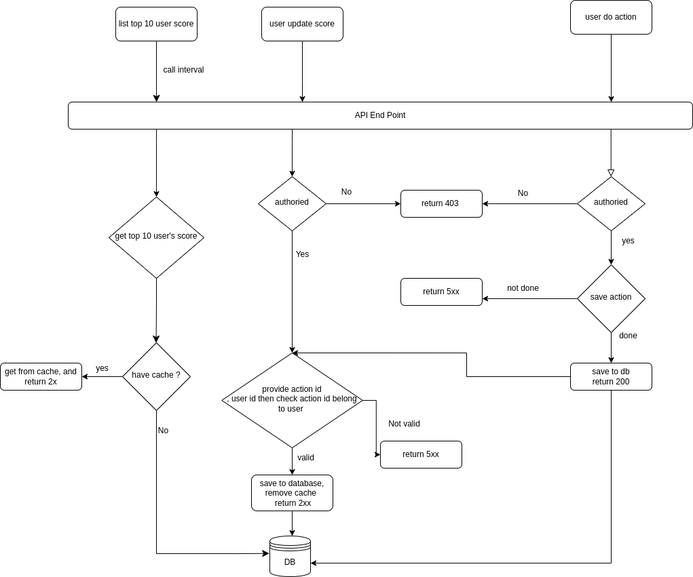

# Project Architecture Functions


1. We have a website with a score board, which shows the top 10 user’s scores.
2. We want live update of the score board.
3. User can do an action ( do not need to care what the action is), completing this action will increase the user’s score.
4. Upon completion the action will dispatch an API call to the application server to update the score.
5. Prevent malicious users from increasing scores without authorisation.

## System 
Nodejs: express, prisma

DB: Mysql

Cache: Redis

Server: Nginx (proxy, load balancing)

## Document

1 Create API with these endpoint 
```
GET: getUserScoreList(limit: number = 10) : json
POST updateAction(actionId: number) : bool
PUT updateUserScore(userId: int, actionId: int)  : number
```
2 Show top 10 user’s scores:
```
use getUserScoreList to get data and return Json data

data in cache ?
   yes: 
     getDataFromCache() :  Json(data)
   no:
     getFromDB() 
     saveDateToCache()
```

3 updateUserScore
```
checkUserAuthorized()  : Boolean
checkUserIsCompleteAction(actionId: number, userId: number) : Boolean
updateUserScore(userId: number) : Boolean
clearCacheData() : Boolean
```

4 updateAction
```
checkUserAuthorized() : Boolean
checkActionIsCompleted(actionId: number, actionData: Object) : Boolean
saveAction(actionData: object) : Boolean
updateUserScore(userId: number, actionId: number ) : number

```

5 We want live update of the score board.
```
Update userScore return current user score then save in local storage.
Front end will use that score to update at frontend user's score
```

## Diagram


## Impovement
1. Use socket to update the realtime data.
2. Convert this system to event driven system 
